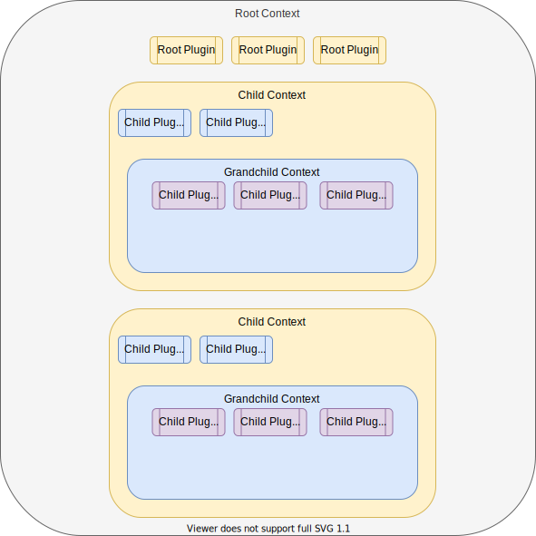

# 캡슐화

Fastify의 기본적인 기능은 "캡슐화 컨텍스트"입니다.
캡슐화 컨텍스트는 [데코레이터](./Decorators.md)나 등록된 [훅](./Hooks.md), 또는 [플러그인](./Plugins.md)이 [라우팅](./Routes.md)에 사용가능하도록 만듭니다.
캡슐화 컨텍스트의 가시적인 표현은 다음 그림에 나와있습니다:



위 그림에서 몇 가지 항목이 있는데:

1. _최상위 컨텍스트_, root context
2. _3개의 최상위 플러그인_, root plugins
3. 각각의 _자식 컨텍스트_
    * 2개의 _하위 플러그인_
    * 각각의 _손자 컨텍스트_
        - 3개의 _하위 플러그인_

모든 _자식 컨텍스트_와 _손자 컨텍스트_는 _최상위 플러그인_에 대한 접근이 가능합니다.
각각의 _자식 컨텍스트_에서는, _손자 컨텍스트_가 _자식 컨텍스트_에 등록된 _자식 플러그인_에 대한 접근이 가능하지만 그것을 포함한 _자식 컨텍스트_에서는 _손자 컨텍스트_에 등록된 _자식 플러그인_에 접근이 *불가능*합니다.

Fastify에 주어진 모든 것은 [플러그인](./Plugins.md)이지만, _최상위 컨텍스트_를 제외합니다.
아래 예제의 모든 "컨텍스트"와 "플러그인"은 데코레이터, 훅, 플러그인, 그리고 라우팅으로 구성될 수 있습니다.
그러므로, 서버에 이 예제를 구체적으로 적용하기 위해서는 3개의 라우팅을 가진 기본적인 REST API 사례를 생각해봐야 합니다: 첫 번째 라우팅 (`/one`)은 인증 절차를 필요로 하고, 두 번째 것(`/two`)은 그렇지 않고, 세 번째 것(`/three`)는 두 번째 것의 컨텍스트에 접근을 합니다.
[fastify-bearer-auth][bearer]를 사용하여 인증 절차를 구현하고 이 사례에 대한 코드는 다음의 예제와 같습니다:

```js
'use strict'

const fastify = require('fastify')()

fastify.decorateRequest('answer', 42)

fastify.register(async function authenticatedContext (childServer) {
  childServer.register(require('fastify-bearer-auth'), { keys: ['abc123'] })

  childServer.route({
    path: '/one',
    method: 'GET',
    handler (request, response) {
      response.send({
        answer: request.answer,
        // request.foo는 publicContext에만 정의되어 있으므로 undefined가 될 것입니다
        foo: request.foo,
        // request.bar는 grandchildContext에만 정의되어 있으므로 undefined가 될 것입니다
        bar: request.bar
      })
    }
  })
})

fastify.register(async function publicContext (childServer) {
  childServer.decorateRequest('foo', 'foo')

  childServer.route({
    path: '/two',
    method: 'GET',
    handler (request, response) {
      response.send({
        answer: request.answer,
        foo: request.foo,
        // request.bar는 grandchildContext에만 정의되어 있으므로 undefined가 될 것입니다
        bar: request.bar
      })
    }
  })

  childServer.register(async function grandchildContext (grandchildServer) {
    grandchildServer.decorateRequest('bar', 'bar')

    grandchildServer.route({
      path: '/three',
      method: 'GET',
      handler (request, response) {
        response.send({
          answer: request.answer,
          foo: request.foo,
          bar: request.bar
        })
      }
    })
  })
})

fastify.listen(8000)
```

위의 서버 예제는 위의 다이어그램에서 언급된 모든 캡슐화 개념을 보여주고 있습니다:

1. 각각의 _자식 컨텍스트_ (`authenticatedContext`, `publicContext`, 그리고 `grandchildContext`)는 _최상위 컨텍스트_에 정의된 `answer` 요청 데코레이터에 접근할 수 있습니다.
2. `authenticatedContext`만 `fastify-bearer-auth` 플러그인에 접근할 수 있습니다.
3. `publicContext`와 `grandchildContext` 모두 `foo` 요청 데코레이터에 접근할 수 있습니다.
4. `grandchildContext`만 `bar` 요청 데코레이터에 접근할 수 있습니다.

실제로 보기 위해서 서버를 시작하고 요청을 날려보세요:

```sh
# curl -H 'authorization: Bearer abc123' http://127.0.0.1:8000/one
{"answer":42}
# curl http://127.0.0.1:8000/two
{"answer":42,"foo":"foo"}
# curl http://127.0.0.1:8000/three
{"answer":42,"foo":"foo","bar":"bar"}
```

[bearer]: https://github.com/fastify/fastify-bearer-auth

<a id="shared-context"></a>

## 컨텍스트간 공유

이전의 예제에서 각각의 컨텍스트가 부모 컨텍스트_에서만_ 상속받는 것을 확인해주세요.
부모 컨텍스트들은 그들 하위의 컨텍스트 항목들에 대해 접근할 수 없습니다.
이 행동은 때때로 원하지 않았던 것일 수도 있습니다.
예를 들어서, 캡슐화 컨텍스트는 하위 컨텍스트에 등록된 [fastify-plugin][fastify-plugin]의 응용으로 상위 컨텍스트에서도 사용될 수 있도록 우회될 수 있습니다.

`publicContext`가 이전 예제의 `grandchildContext` 안에 정의된 `bar` 데코레이터가 필요하다고 가정해보세요.
코드는 아래와 같이 다시 작성될 수 있습니다:

```js
'use strict'

const fastify = require('fastify')()
const fastifyPlugin = require('fastify-plugin')

fastify.decorateRequest('answer', 42)

// `authenticatedContext`가 단숨함을 위해 전제되었습니다

fastify.register(async function publicContext (childServer) {
  childServer.decorateRequest('foo', 'foo')

  childServer.route({
    path: '/two',
    method: 'GET',
    handler (request, response) {
      response.send({
        answer: request.answer,
        foo: request.foo,
        bar: request.bar
      })
    }
  })

  childServer.register(fastifyPlugin(grandchildContext))

  async function grandchildContext (grandchildServer) {
    grandchildServer.decorateRequest('bar', 'bar')

    grandchildServer.route({
      path: '/three',
      method: 'GET',
      handler (request, response) {
        response.send({
          answer: request.answer,
          foo: request.foo,
          bar: request.bar
        })
      }
    })
  }
})

fastify.listen(8000)
```

서버를 다시시작하고 `/two`와 `/three`에 다시 요청을 날려보세요:

```sh
# curl http://127.0.0.1:8000/two
{"answer":42,"foo":"foo","bar":"bar"}
# curl http://127.0.0.1:8000/three
{"answer":42,"foo":"foo","bar":"bar"}
```

[fastify-plugin]: https://github.com/fastify/fastify-plugin
